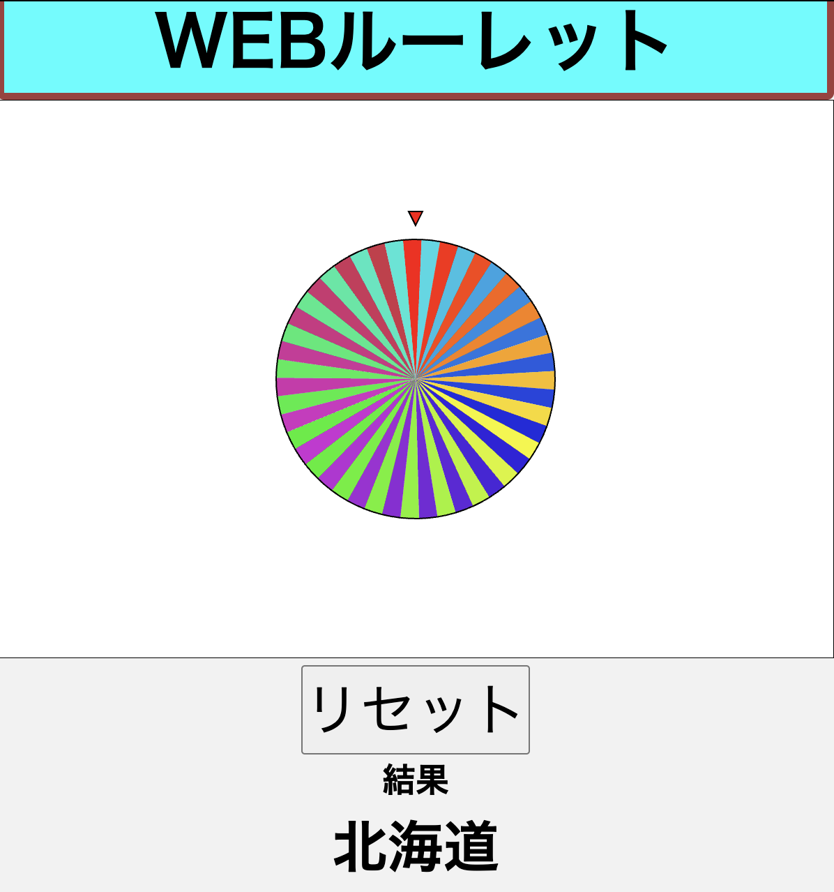
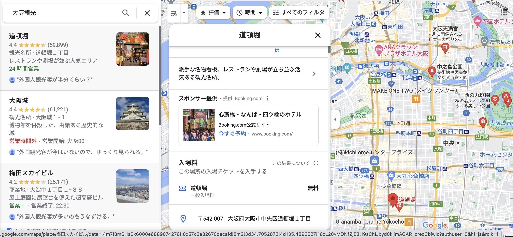
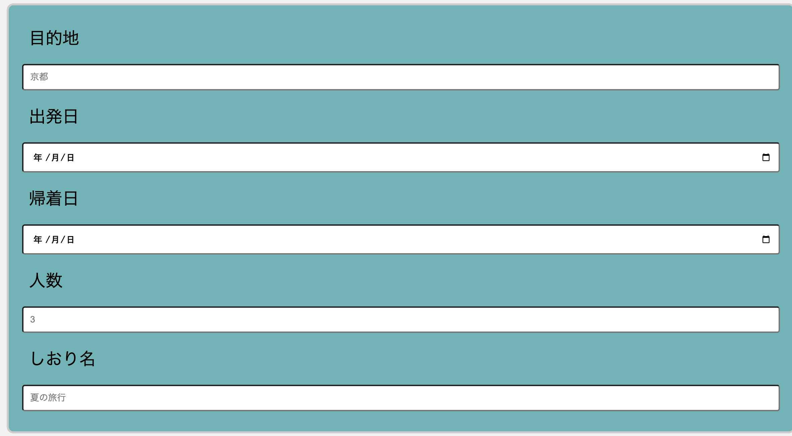
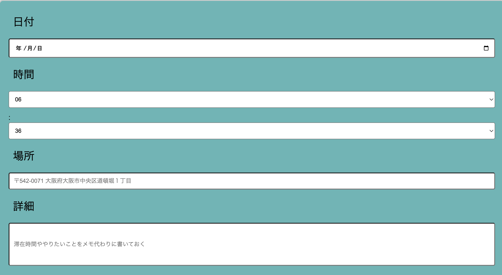
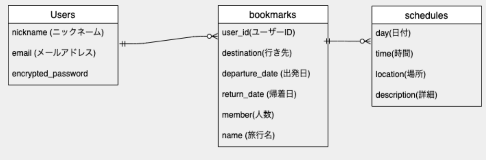
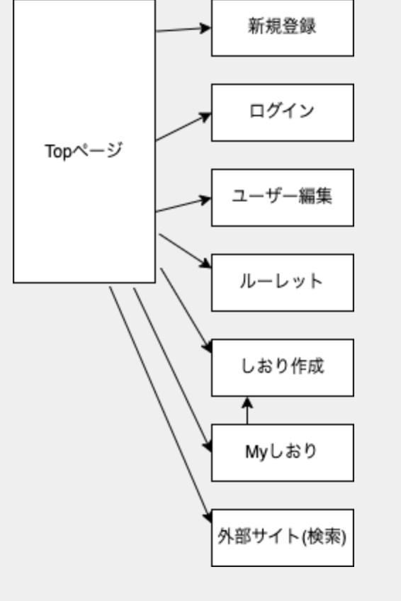

## アプリケーション名

---

Travel

## アプリケーションの概要

---

旅行行きたいけど行く場所決めきれない人のたの旅アプリです

## URL

---

http://52.192.74.145/

## テスト用アカウント

---

・Basic 認証パスワード　： 
・Basic 認証 ID : 
・メールアドレス :test@test.com 
・パスワード :T123456

## 利用方法

### 新規登録・ログイン

---

1.トップページより新規登録・ログインを行う

### ルーレットを使用する

---

１.トップページのヘッダーよりルーレットページに遷移する  2.スタートボタンを押すことでルーレットが始まりストップボタンで止めることができる  3.行きたくない都道府県があったら除外することもできる

### 目的地検索機能を使用する

---

1.ヘッダーより目的地検索を押すことで googlemap に遷移することができる  2.「大阪　おすすめスポット」などで調べることで観光スポットやレストランなど検索することが可能  3.そこで調べた保存しておくことでしおり作成の際に書きやすくなる

### しおり作成を行う

---

1.トップページからしおり作成ボタンを押すことでしおり新規作成ページに遷移ができる 2.ルーレットや目的地検索で調べた内容をしおりに記入して自分の好きなようにしおりの作成ができる

## アプリケーションを作成した背景

---

自分自身が優柔不断ということもあり旅行行こうと思っていても予定を立てる段階で辞めてしまっているということがありルーレット機能や検索機能が充実してるアプリ欲しいなと思い作成することにした。

## 洗い出した要件

---

[要件を定義したシート](https://docs.google.com/spreadsheets/d/1aPDWAjlOj594v1R0zRG7Q54uS--7iux9eIv512lKkpM/edit#gid=0)

## 実装した機能についての画像や GIF およびその説明

---

ルーレットを回した後の写真です。リセットを押すことでスタートボタンが出てきてもう一度ルーレット回すことができます

この写真は、googlemap で検索ボックスに調べたい内容を入力することでいろいろ情報を得ることができます

しおりの一部です。基本的には日付と時間と場所と詳細を入力してしおりを作成していきます。

## 実装予定の機能

---

現在、検索機能が最低限の機能しかないため googleAPI を使用して検索できるように考えています。

## データベース設計

---

## 画面遷移図

---

## 開発環境

---

・フロントエンド HTML.CSS.javascript 
・バックエンド ruby on rails 
・インフラ AWS 
・テスト　 RSpec 
・テキストエディタ VS code 

## 工夫したポイント

アプリの使いやすさを重視して設計を行いました。直感的にアプリを操作できるような UI にできたと思います。アプリとしてまだまだ未完成な部分があるので追加実装をして使いやすいアプリを目指そうと思います。
